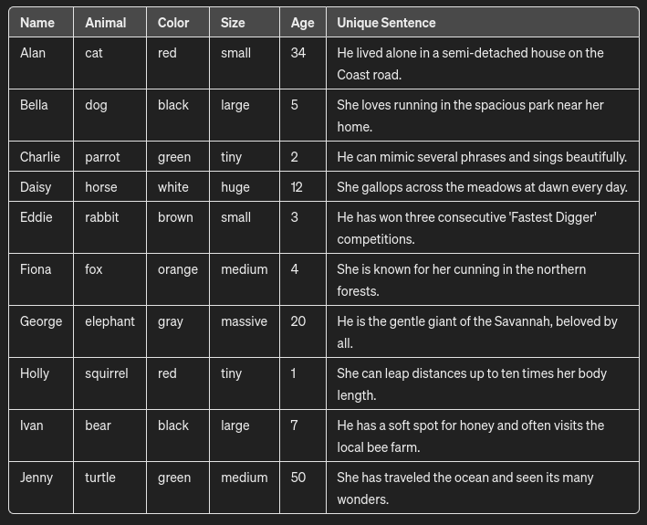
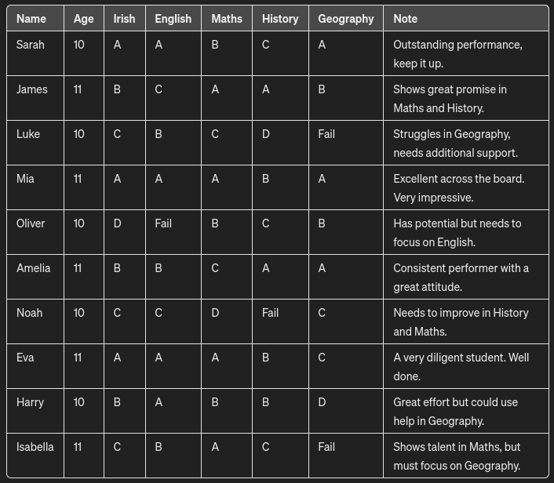

# Local Document Retrieval and Answer Generation Script Using RAG Techniques

This script is an exploration into using Retrieve-and-Generate (RAG) techniques locally, emphasizing privacy and data control by avoiding third-party servers, such as OpenAI. It leverages open-source technologies and models to process and search through documents, aiming to generate answers to user queries based on local markdown document content.

## Core Technologies and Techniques

- **LangChain and Chroma**: For advanced document retrieval. Chroma, a retrieval technique from LangChain, is utilized for its vector storage and similarity search capabilities, crucial for the RAG approach.
- **Local Language Model Execution**: Utilizes a local instance of the Mistral language model for generating responses, aiming to keep data processing in-house and secure.

## Workflow Overview

1. **Document Processing**: Loads and processes markdown files from a local directory, converting them to plain text.
2. **Retrieval with Chroma**: Employs the Chroma vector store for document retrieval based on query similarity, a key component of the RAG technique.
3. **Answer Generation**: Utilizes local execution of the Mistral language model to generate answers, focusing on maintaining data privacy and avoiding external dependencies.

## Getting Started for First-Time Users

Follow the below steps to test this script on your local machine. It will guide you through the setup process and demonstrate the local RAG capabilities.

### Prerequisites

Before starting, ensure that you have Python installed on your system. This project is developed and tested with Python 3.11.7.

### Step-by-Step Setup

1. **Install Ollama and Mistral**:
   - These tools are crucial for the local execution of language models. Visit their respective websites or repositories for installation instructions. Ensure that they are correctly installed and accessible from your command line.

2. **Clone the Repository**:
   - Use Git to clone this repository to your local machine. Open your CLI and run:
     ```
     git clone <repository-url>
     ```
   Replace `<repository-url>` with the actual URL of this GitHub repository.

3. **Navigate to the Project Directory**:
   - After cloning, move into the project directory by executing:
     ```
     cd <repository-name>
     ```
   Replace `<repository-name>` with the name of the folder created by the cloning process.

4. **Install Python Dependencies**:
   - This project relies on several Python libraries. Install them by running:
     ```
     pip install -r requirements.txt
     ```
   This command reads the `requirements.txt` file and installs all listed libraries.

5. **Run the Main Script**:
   - With all dependencies installed, you're ready to run the main script. Execute:
     ```
     python main.py
     ```
   This starts the script, and you will be prompted to enter your query directly in the console.

### First Use

Upon running `main.py`, the script will guide you through the process of entering a query and will display the generated answer based on the local documents processed. It's a demonstration of the system's capability to perform RAG techniques entirely locally, ensuring privacy and data security.

## Repository Layout

This section provides an overview of the repository's structure, helping you navigate and understand the different components of the project.

```plaintext
├── 📁 local-rag
│   │   📄 main.py
│   │   📄 README.md
│   │   📄 requirements.txt
│   ├── 📁 sample_data
│   │   │   📄 alan_cat.md
│   │   │   📄 bella_dog.md
│   │   │   📄 charlie_parrot.md
│   │   │   📄 daisy_horse.md
│   │   │   📄 eddie_rabbit.md
│   │   │   📄 fiona_fox.md
│   │   │   📄 george_elephant.md
│   │   │   📄 holly_squirrel.md
│   │   │   📄 ivan_bear.md
│   │   │   📄 jenny_turtle.md
│   ├── 📁 sample_data2
│   │   │   📄 Amelia.md
│   │   │   📄 Eva.md
│   │   │   📄 Harry.md
│   │   │   📄 Isabella.md
│   │   │   📄 James.md
│   │   │   📄 Luke.md
│   │   │   📄 Mia.md
│   │   │   📄 Noah.md
│   │   │   📄 Oliver.md
│   │   │   📄 Sarah.md
```

### Explanation of Key Folders

- **`sample_data`**: This folder contains markdown files with information about various animal characters. Each file is dedicated to a different animal, providing a rich set of data to ask questions about. This data serves as a test set for document retrieval and processing capabilities of the script.

  

- **`sample_data2`**: Similar to `sample_data`, this folder houses markdown files; however, it focuses on hypothetical student profiles. Each file represents a student, offering background information that can be used for testing the document retrieval system in a different context.

  

These folders help test the script's ability to retrieve and generate answers based on different types of documents, showcasing the flexibility and adaptability of the local RAG system.

## Current Shortcomings and Areas for Improvement

- **Retrieval and Context Quality**: The current setup lacks sophistication in how documents are retrieved and the context provided to the language model.
- **Performance**: Running the language model locally is resource-intensive, affecting speed and efficiency.
- **Model Limitations**: The Mistral language model, while functional, does not meet all the desired performance criteria.
- **Text Conversion Issues**: Challenges in accurately converting markdown to plain text before context generation.
- **Metadata Utilization**: Lacks incorporation of document metadata (e.g., file names) in the retrieval process.
- **SEO and Retrieval Logic**: The need to implement SEO techniques for data retrieval and storage, including the use of keywords to enhance retrieval accuracy.
- **Interface and UXD**: Currently the user must interact with the model through the console. The way the user interacts with the data should be improved and the output should likely be returned as markdown.

## Future Directions

Improving the script will involve enhancing the text conversion process, optimizing local model performance, and refining retrieval techniques to include document metadata and SEO strategies. The goal is to create a more sophisticated and efficient local RAG system that respects user privacy and offers high-quality, relevant responses.

This initiative aligns with the broader movement towards open-source, locally controlled AI tools, ensuring that sensitive data remains secure and processing is transparent and customizable.
